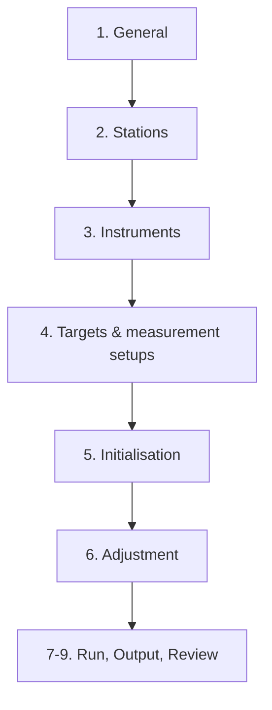

# Flow de création d'un processing topographique

Ce document décrit le parcours utilisateur cible depuis la création du processing jusqu'à sa
première exécution. Il complète les règles d'identité physique de
[`06-physical-points.md`](06-physical-points.md) et le design des configurations de mesure de
[`07-measurement-setup-design.md`](07-measurement-setup-design.md).

## Principes UX

- parcours compact par défaut, détails accessibles dans `Advanced options` ;
- aucune expertise supposée à partir du rôle utilisateur ;
- réutiliser les mappings et configurations déjà validés avant de demander une nouvelle saisie ;
- ne jamais fusionner des points sur leur nom seul ;
- séparer les points réellement communs des cibles individuelles ;
- afficher avant création tout fallback, correction non nulle et faiblesse géométrique ;
- toute configuration utilisée par un run devient immuable et versionnée.

## Vue d'ensemble

## Étape 1 — General

L'utilisateur saisit :

- nom et description du processing ;
- type `Single station` ou `Multi-station network` ;
- site ;
- template pays ;
- activation immédiate ou création inactive.

Le projet BTM est implicite dans le contexte de navigation. La page affiche en format compact
la période d'observation, la dernière observation, le volume de données, les cibles observées et
les variables disponibles.

Le template pays préremplit des valeurs ; il ne crée aucune identité de point physique.

## Étape 2 — Stations

L'utilisateur sélectionne une station ou les stations formant le réseau.

BTM affiche seulement les informations utiles au choix : dernière observation, nombre de cibles,
cycle estimé, disponibilité T/P et état de préparation.

Après sélection, BTM recherche :

1. une configuration active utilisant les mêmes identifiants de stations ;
2. un mapping historique compatible avec la période ;
3. une configuration archivée que l'utilisateur peut choisir comme modèle.

Résultat attendu : `58 mappings réutilisés · 8 nouvelles cibles à examiner` plutôt qu'une
reconfiguration complète.

## Étape 3 — Instruments

Pour chaque station :

- instrument template ;
- hauteur d'instrument ;
- politique atmosphérique ;
- résumé des types de mesure détectés.

Le mode EDM n'est pas une valeur globale obligatoire. Il est résolu par observation ou par
configuration `station × cible`. Un défaut station peut exister en option avancée uniquement
comme fallback explicite.

## Étape 4 — Targets & Measurement Setups

### 4.1 Chargement des cibles

Pour chaque cible BTM : nom source, identifiant stable, station, type de mesure, rôle, inclusion,
publication et configuration de correction.

Une cible nouvelle :

- reste distincte par défaut ;
- reçoit une configuration de mesure proposée par le template ;
- est marquée `To review` ;
- n'est jamais ajoutée silencieusement à l'ajustement.

### 4.2 Configuration des mesures

Les types supportés sont Prism, Reflective sheet et Reflectorless. Les constantes, valeurs déjà
appliquées et poids sont résolus cible par cible. Les modifications en lot traitent rapidement
les groupes homogènes ; les exceptions restent éditables individuellement.

### 4.3 Cibles individuelles

Les cibles observées par une seule station ou explicitement distinctes restent dans le tableau
normal. Leur identifiant physique interne n'est pas affiché dans le parcours compact.

### 4.4 Identité réseau

La maquette ne déduit jamais un point commun depuis `TargetName` ou `AdjustmentName`. Pour un
nouveau réseau, toutes les cibles des différentes stations restent distinctes. Un mapping peut
être réutilisé automatiquement uniquement s'il s'agit d'un mapping physique versionné et déjà
validé pour les stations et la période concernées.

Pour un processing mono-station, la partie points communs est sautée. L'utilisateur passe
directement à l'initialisation.

Pour un réseau multi-stations, l'écran contient trois blocs distincts.

### Bloc A — Shared physical points

Le tableau contient seulement les points confirmés communs à plusieurs stations et les candidats
en cours de validation. Les autres cibles ne polluent pas cette vue.

Sources possibles :

- mapping versionné réutilisé ;
- mapping physique explicite importé, jamais un simple nom Lookup ;
- correspondances manuelles ;
- suggestions géométriques après initialisation manuelle.

### Bloc B — Assistant `Find common points`

Par paire de stations :

1. sélectionner deux correspondances certaines au minimum ;
2. une troisième correspondance non alignée est demandée par défaut pour validation robuste ;
3. cliquer `Check` ;
4. BTM calcule une transformation provisoire depuis les nuages locaux Hz/Vz/Sd ;
5. BTM propose les autres correspondances compatibles dans les tolérances H/V ;
6. l'utilisateur décoche les faux candidats et confirme les vrais points communs.

Avec un seul point commun, le bouton `Check` reste bloqué si l'orientation relative n'est pas
connue par ailleurs. Avec exactement deux points, le résultat porte le statut `Weak geometry`.

Le tableau de validation montre : stations/cibles, noms source, résidus horizontal/vertical/3D,
source de la proposition, confiance, distribution géométrique et décision.

### Bloc C — Known geometric relationships

L'utilisateur peut ajouter une distance, différence de hauteur, azimut-distance ou vecteur 3D
entre deux points qui restent distincts.

Ces relations :

- ne créent jamais une identité commune ;
- possèdent une valeur, une incertitude et une période de validité ;
- complètent la géométrie mais une distance seule ne remplace pas deux points communs ;
- sont exportées vers STAR*NET seulement si elles sont supportées et résolues.

### Connectivité

Une matrice ou un graphe synthétique affiche les connexions :

| Stations | Points communs confirmés | Relations connues | État |
|---|---:|---:|---|
| STA1 ↔ STA2 | 4 | 0 | Connected |
| STA1 ↔ STA3 | 2 | 1 distance | Weak geometry |
| STA2 ↔ STA3 | 0 | 0 | Not connected |

Le simple fait que le graphe soit connecté ne garantit pas l'observabilité. Un contrôle de rang
reste obligatoire avant l'ajustement.

## Étape 5 — Initialisation

Cette étape rassemble le datum et le calcul des coordonnées initiales. L'utilisateur choisit une
seule des deux méthodes :

1. `Use known reference coordinates` : sélectionner un Reference Set, ajouter si nécessaire des
   cibles de référence, puis saisir ou modifier E/N/H et les contraintes/sigmas par composante ;
2. `No coordinates — fix one station` : choisir la station ancre et saisir E/N/H/orientation ;
   `0 / 0 / 0 / 0` est autorisé pour un repère local.

Pour un nouveau processing, la deuxième méthode est sélectionnée par défaut et aucun tableau de
coordonnées n'est prérempli. Des coordonnées ne sont proposées que si elles existent réellement
dans BTM pour le projet sélectionné, ou si l'utilisateur choisit explicitement de les saisir.
Les coordonnées synthétiques utilisées par les scénarios de démonstration ne sont jamais
présentées comme des données BTM.

Il n'est jamais demandé de choisir un jeu vide de références puis de comprendre les alertes d'un
datum global. Les contrôles de références ne sont affichés que pour la première méthode.

L'utilisateur choisit ensuite une **fenêtre d'observations d'initialisation**. Cette fenêtre est
uniquement la provenance des mesures servant au calcul ; elle ne définit ni la validité des
coordonnées initiales ni celle de la configuration. Pour chaque couple `station × cible`, BTM
construit une observation représentative par médiane de Hz, Vz et de la distance inclinée corrigée.
Une valeur aberrante ou le dernier cycle de la fenêtre ne devient donc pas automatiquement la
valeur initiale.

Avant le calcul, l'écran affiche :

- le nombre de points physiques disponibles / attendus et le pourcentage correspondant ;
- le nombre de couples `station × cible` disponibles / attendus ;
- le nombre d'observations brutes et de représentants médians utilisés ;
- la liste des couples absents de la fenêtre sélectionnée.

La validité des coordonnées initiales suit la version du processing. La date `validFrom` de cette
version est choisie séparément dans les informations générales et reste indépendante de la
fenêtre d'observations.

Après validation de l'identité :

1. choisir une station ancre et ses coordonnées/orientation connues, ou un repère local
   `0,0,0,0` ;
2. transformer les autres nuages locaux au moyen des points communs confirmés ;
3. utiliser les relations géométriques connues uniquement lorsqu'elles apportent des contraintes
   suffisantes et non ambiguës ;
4. propager la mise en place dans le graphe des stations ;
5. calculer une estimation par cible et la dispersion des estimations multi-stations ;
6. rapprocher le réseau des références connues lorsqu'un système réel est fourni ;
7. enregistrer les coordonnées initiales dans le snapshot de la version du processing.

Les échecs sont explicites : orientation indéterminée, composante déconnectée, points communs
alignés, ambiguïté de transformation ou résidus supérieurs aux tolérances.

## Étape 6 — Adjustment

Le template d'ajustement propose les poids et contrôles standards. Les options avancées donnent
accès aux paramètres complets, au χ², à l'autocorrection, aux erreurs de centrage et aux seuils.

La vue compacte affiche le template et sa provenance, dimension, système, unité angulaire,
itérations, χ², confiance, propagation et résumé d'autocorrection. La convergence porte le
libellé et l'unité propres au moteur. Les options avancées contiennent réfraction/rayon,
pondérations, centrage et paramètres spécifiques au moteur.

Le preset UK reprend le projet STAR*NET HS2/NTE fourni. Le preset France conserve la source
CoMeT et n'applique que les traductions démontrées. Une fonction non disponible, comme Huber ou
VCE Helmert, apparaît `Non transposé` plutôt que d'être remplacée silencieusement par une option
au nom voisin. Les règles complètes figurent dans
[`10-adjustment-template-mapping.md`](10-adjustment-template-mapping.md).

Les poids distance utilisés proviennent de chaque configuration de mesure résolue, pas d'un
unique mode EDM de station.

Un test manuel permet d'exécuter une époque avant sauvegarde définitive.

## Étape 7 — Run & Synchronization

L'utilisateur choisit :

- event-driven ou déclenchement toutes les X minutes ;
- tolérance de synchronisation ;
- âge maximal de réutilisation d'une observation de station manquante ;
- comportement provisoire ;
- catch-up lors de l'arrivée tardive des vraies données ;
- limites de recalcul.

L'époque reste le timestamp source de chaque station. Cette étape ne modifie pas l'identité des
points ni les coordonnées initiales.

## Étape 8 — Output

L'utilisateur choisit les coordonnées, déplacements, incertitudes et indicateurs qualité à
publier. Le timestamp de publication est aligné sur la grille demandée, par exemple `00/30`,
sans écraser les timestamps source.

Un résultat moteur est remappé par :

`engineName → PhysicalPoint → cible(s) BTM → sorties BTM`.

## Étape 9 — Review & Create

La revue affiche en priorité :

- stations et période ;
- points communs confirmés, candidats exclus et composantes faibles ;
- relations géométriques connues ;
- références et coordonnées initiales ;
- modes de mesure/fallbacks ;
- corrections de distance non nulles ;
- configuration d'ajustement, run et output ;
- noms moteur qui seront écrits dans le `.DAT` ;
- erreurs bloquantes et avertissements.

Actions : `Test one epoch`, `Create inactive`, `Create and activate`.

La création sauvegarde une configuration complète et versionnée. Le premier run utilise un
snapshot immuable contenant mapping, relations, templates résolus, corrections et noms moteur.

## Cas d'acceptation minimal — nouveau réseau

1. L'utilisateur sélectionne trois stations sans mapping existant.
2. Il configure trois paires manuelles certaines entre STA1 et STA2.
3. `Check` propose cinq autres points ; il en retire un et confirme quatre.
4. Il configure trois points communs entre STA2 et STA3.
5. Il ajoute une distance connue entre deux points distincts comme contrôle.
6. Le réseau est connecté et la géométrie robuste.
7. Les coordonnées initiales sont calculées depuis STA1 ancrée en local.
8. Review distingue clairement huit points partagés, les cibles individuelles et la ligne de
   base connue.
